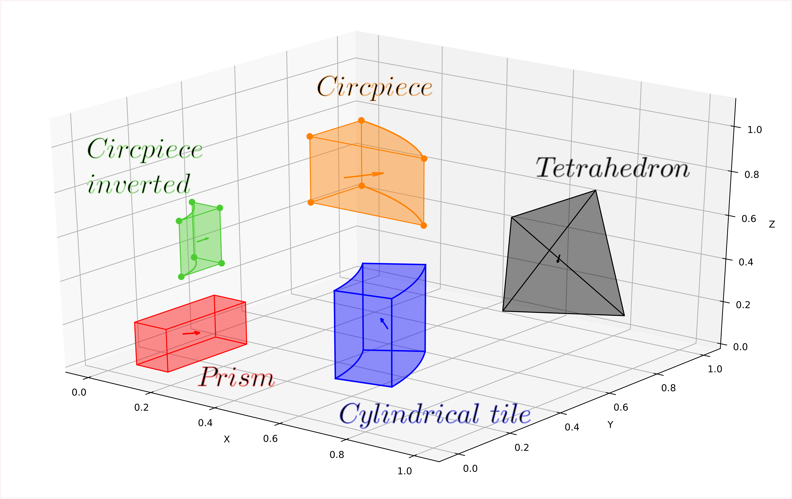
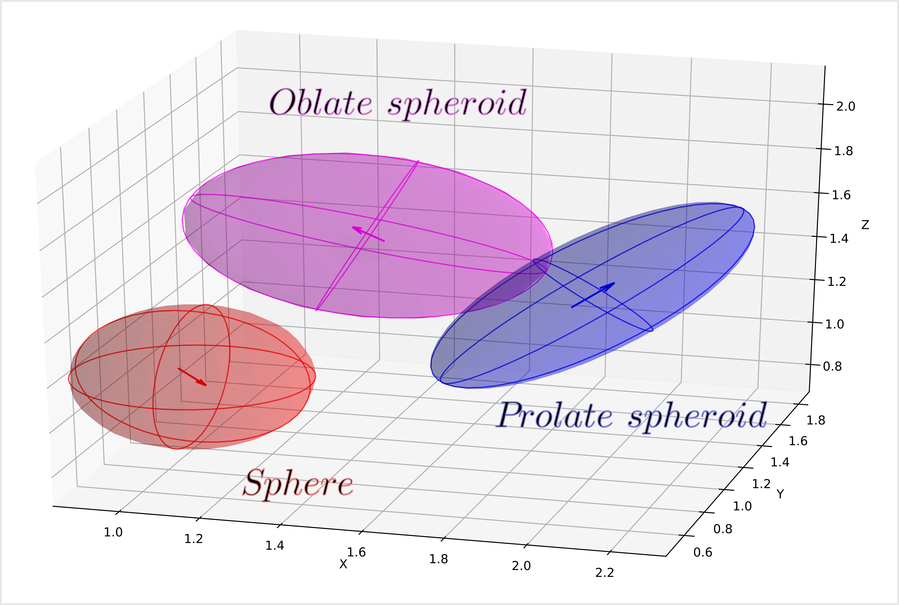
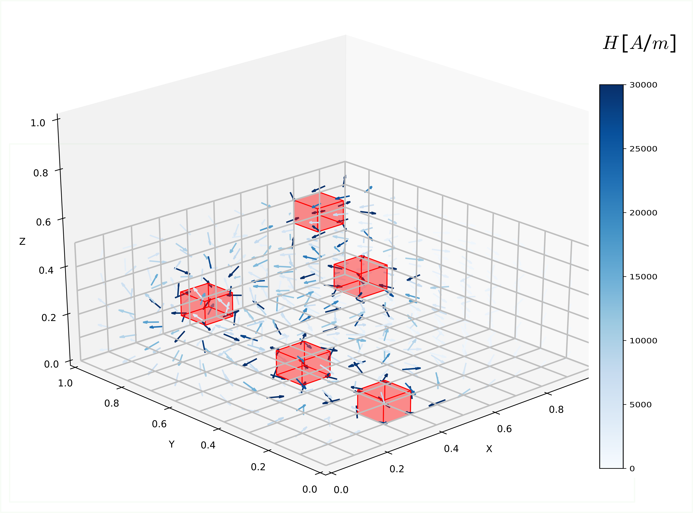
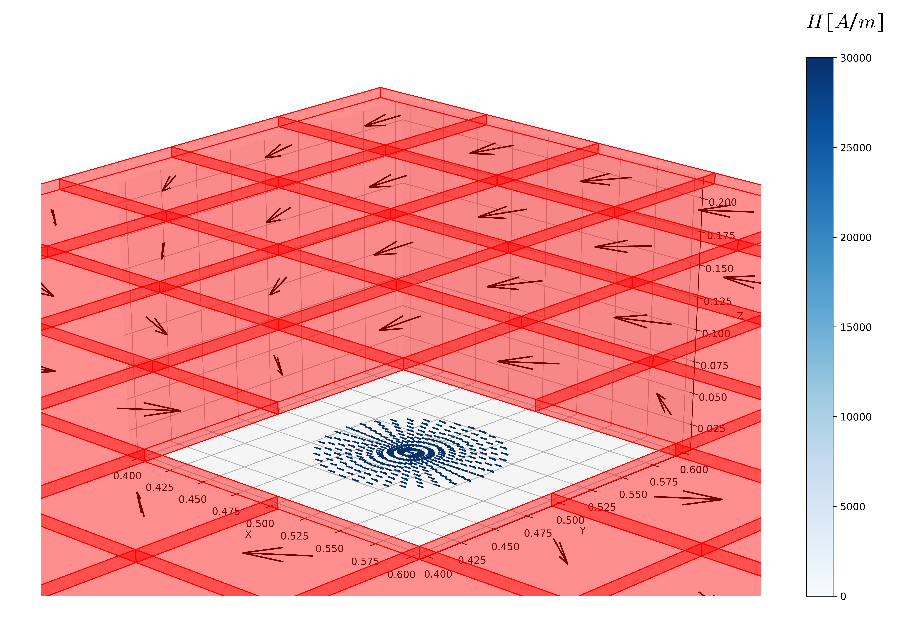
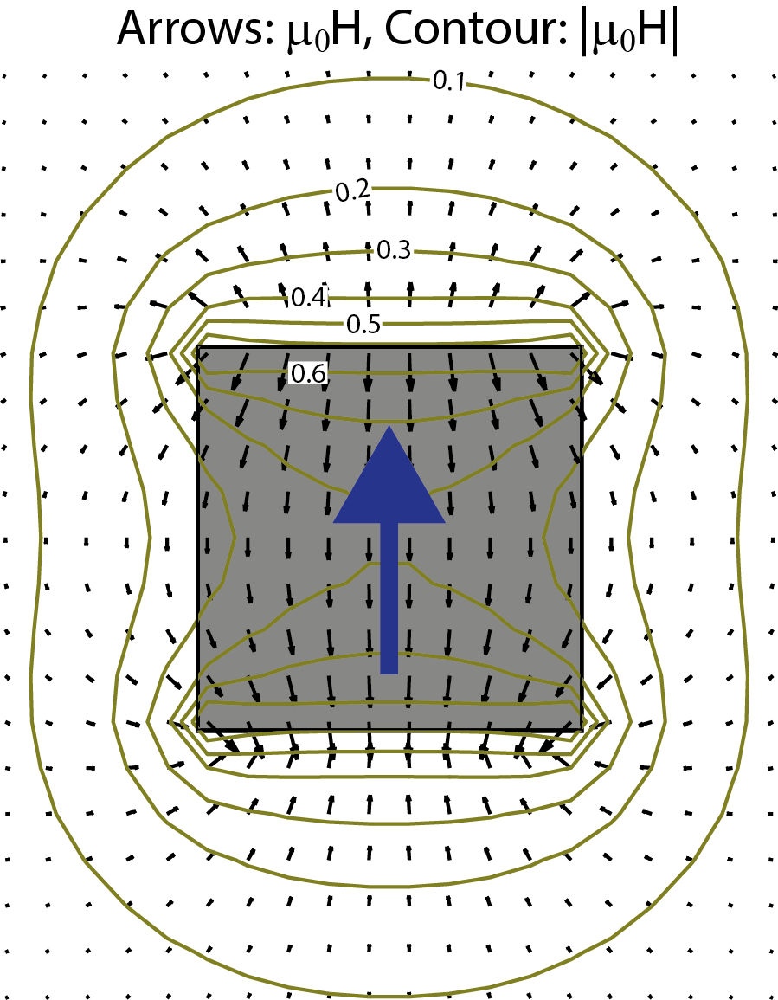

Gallery
========================================

========================================
Basic Geometries
========================================

========================================
Evaluation points and H-vector
========================================

========================================
Magnetic field
========================================
