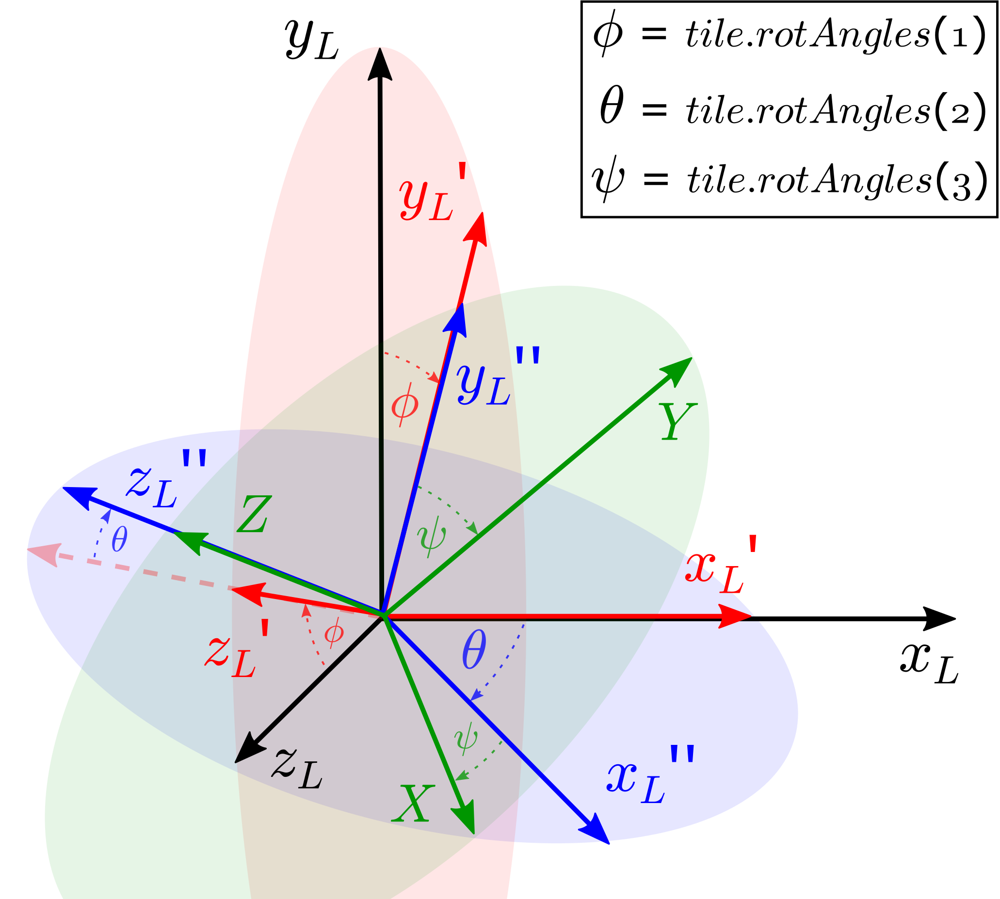

Theoretical aspects
========================================

========================================
Tiles
========================================
The goal of this section is to describe how the tiles behave 
geometrically through specifying their Origin, dimensions and 
Euler angles. 

In general, the demagnetization tensor for each tile type is found 
with respect to the local Origin of the tile and assuming the tile 
not to be rotated. The tile's local Origin is defined through the 
vector :math:`r'` with respect to the global Origin. The field is 
found at the position :math:`r` with respect to the global 
coordinate system (G).

We let **P** denote the matrix representing the mapping from the local (L)
to the global coordinate system (G). As the demagnetization tensor is 
always found with respect to L and it takes the relative distance as 
input, we get the geometrical part of the field (not including magnetization)
to be:

.. math::

    K(r) = \text{P} N (\text{P}^{-1}(r - r')).

The magnetization with respect to the global coordinate system is given by
(for a hard magnet characterized by an anisotropic permeability tensor):

.. math::

    [M]_G = (\text{P}[\mu]_L) H + M_{rem}[\hat{u}_{ea}]_G,

where the magnetic field in the global system is denoted :math:`H`, 
the magnitude of the remanence is :math:`M_{rem}` and the unit vector 
defining the easy-axis of the permanent magnet in the global system is 
:math:`[\hat{u}_{ea}]_G = \text{P} [\hat{u}_{ea}]_L`. As an example, 
consider e.g. a prism magnetized along the prism's x-direction. Then 
:math:`[\hat{u}_{ea}]_L = (1, 0, 0)`.

The field in the global system then becomes:

.. math::

    H &= K(r)[M]_L = K(r) \text{P}^{-1} [M]_G \\
    & = \text{P} N (\text{P}^{-1}(r - r')) (\text{P}[\mu]_L) H + \text{P} (M_{rem}[\hat{u}_{ea}]_L)

Now, finding the **P** matrix and its inverse needs to be done. 
This is described in the section `rotations`_.

----------------------------------------
Rotations
----------------------------------------

So far, we only consider this transformation to consist of three rotations;
about the :math:`x`, :math:`y` and :math:`z` axes in that order with the angles 
:math:`\phi` (roll), :math:`\theta` (pitch) and :math:`\psi` (yaw). 
Since the global coordinate system coincides with the canonical xyz-system, 
**P** simply consists of the three (column) vectors defining the orthonormal 
basis of the *local* system, expressed with respect to the global system:

.. math::
    
    \text{P} = \{ [\hat{e_x}]^T_G, [\hat{e_y}]^T_G, [\hat{e_z}]^T_G \}
	
These unit vectors may be found through applying the rotation matrices in
the correct order (intrinsic rotation with sequence :math:`x_L-y_L'-z_L''` 
or extrinsic rotations with :math:`z_G-y_G-x_G`):
 
.. math::

    \text{P} = Rot_x(\phi) Rot_y(\theta) Rot_z(\psi).

Finally, as **P** is orthogonal, we have that

.. math::

    \text{P}^{-1} &= Rot_z(\psi)^{-1} Rot_y(\theta)^{-1} Rot_x(\phi)^{-1} \\
    & = Rot_z(\psi)^T Rot_y(\theta)^T Rot_x(\phi)^T

^^^^^^^^^^^^^^^^^^^^^^^^^^^^^^^^^^^^^^^
Implementation
^^^^^^^^^^^^^^^^^^^^^^^^^^^^^^^^^^^^^^^

In the `code <https://github.com/cmt-dtu-energy/MagTense/blob/master/source/DemagField/DemagField/DemagFieldGetSolution.f90#L911>`_,
the rotation matrix **rotMat** and its inverse **rotMatInv** are calculated.
They are applied in the subroutine `getFieldFromTile <https://github.com/cmt-dtu-energy/MagTense/blob/a83ce2650b39781b1e0031ceb51de6e1eb5d6f1e/source/DemagField/DemagField/DemagFieldGetSolution.f90#L671>`_.
Hereby, the evaluation points, which are defined with respect to the global 
coordinate system, are rotated with **rotMat** into the *local* system of 
the considered tile.

The three :ref:`rotation angles <rotation angles>` (:math:`\phi, \theta, \psi`) rotate the given tile 
intrinsically about the orthonormal basis of the *local* system in the order 
:math:`x_L-y_L'-z_L''`.
This corresponds to a extrinsic rotation with sequence :math:`z_G-y_G-x_G` in the global 
system.

To bring the evaluation points into the *local* system of the considered tile, the
negative rotation angles have to be applied in opposite order.

.. math::

    Rot_x(-\phi) = 
    \begin{bmatrix}
    1 & 0 & 0\\
    0 & cos(-\phi) & -sin(-\phi)\\
    0 & sin(-\phi) & cos(-\phi)
    \end{bmatrix}
    =
    \begin{bmatrix}
    1 & 0 & 0\\
    0 & cos(\phi) & sin(\phi)\\
    0 & -sin(\phi) & cos(\phi)
    \end{bmatrix}
    =
    Rot_x(\phi)^T.

Similarly, :math:`Rot_y(-\theta) = Rot_y(\theta)^T` and :math:`Rot_z(-\psi) = Rot_z(\psi)^T`.

**rotMat** and **rotMatInv** are defined as follows:

.. math::

    \text{rotMat} &= Rot_z(-\psi) Rot_y(-\theta) Rot_x(-\phi) \\
    & = Rot_z(\phi)^T Rot_y(\theta)^T Rot_x(\psi)^T

.. math::

    \text{rotMatInv} &= Rot_x(-\phi)^T Rot_y(-\theta)^T Rot_z(-\psi)^T \\
    & = Rot_x(\phi) Rot_y(\theta) Rot_z(\psi)

**rotMatInv** is the mapping from the *local* system of the given tile to the global coordinate system
and corresponds to our **P** in the theoretical part. As we are performing a rotation in the
*local* system (intrinsically), post-multiplication applies for the rotation matrices.

    Rotations of a tile are performed in its local coordinate system. 
    Firstly, the tile is rotated with :math:`\phi` around its local x-axis.
    Secondly, the local y-axis is rotated by :math:`\theta`.
    Eventually, the angle :math:`\psi` is performed around the local z-axis.
    :math:`\{ X^T, Y^T, Z^T\}  \hat{=} \{ [\hat{e_x}]^T_G, [\hat{e_y}]^T_G, [\hat{e_z}]^T_G \}`.