# Sample plots

## Basic geometries

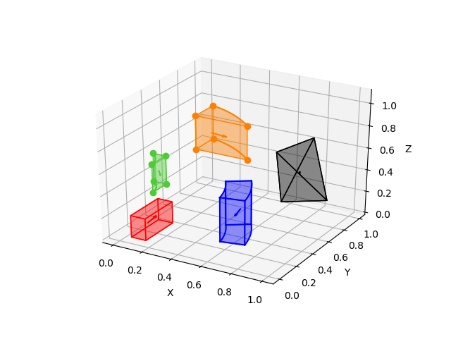

## Cylinder

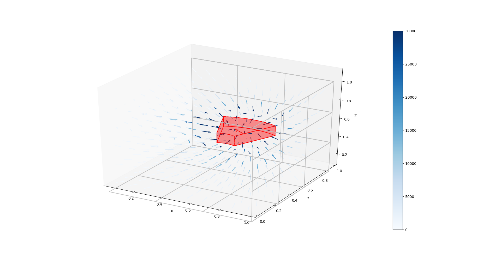

## Four prism tiles

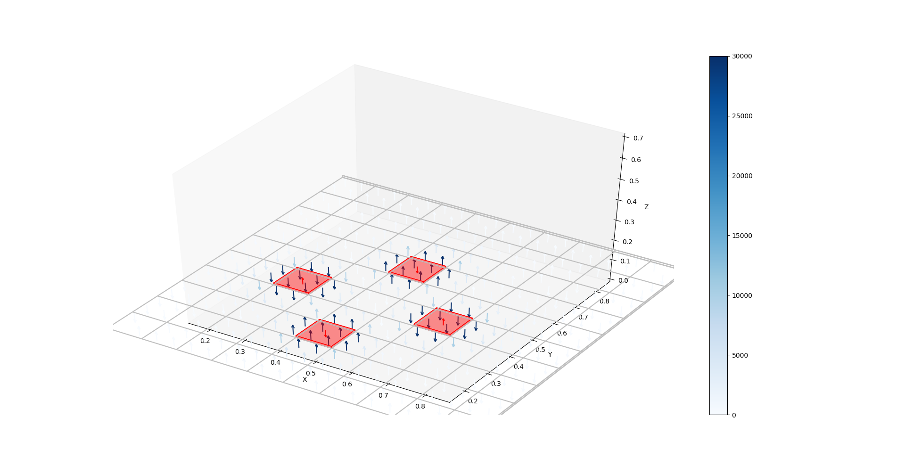

## Halbach magnet

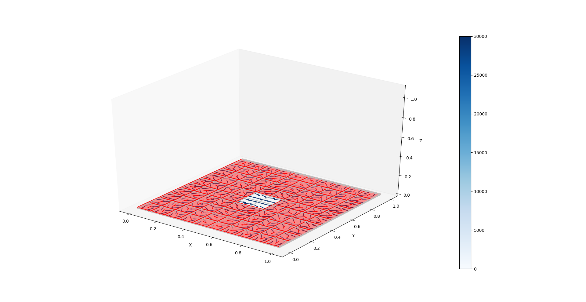

## Prisms 3D

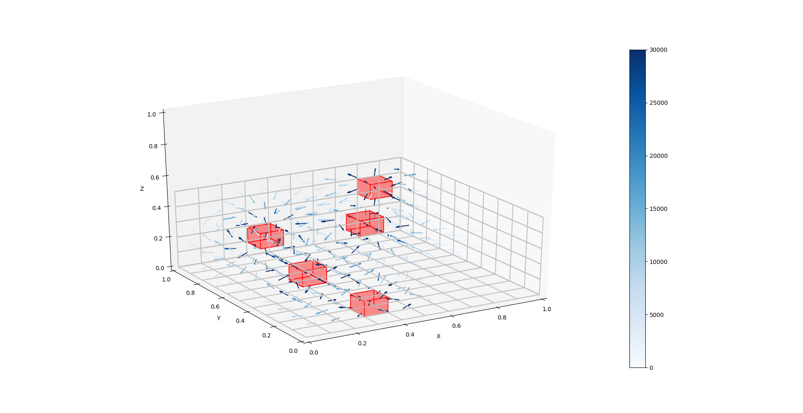

## Spheroid

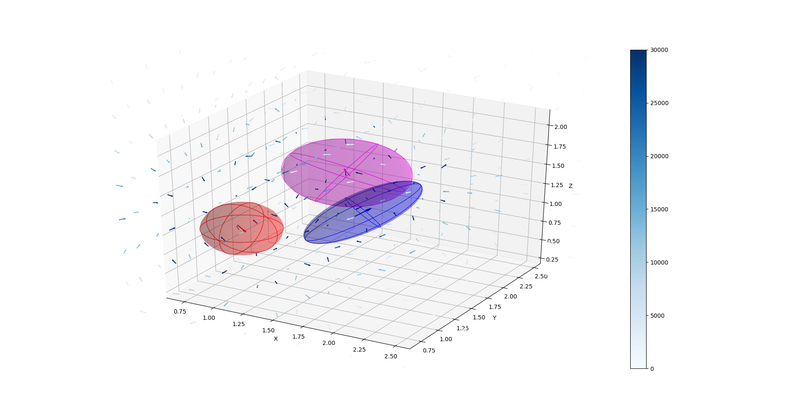

## Validation circular piece

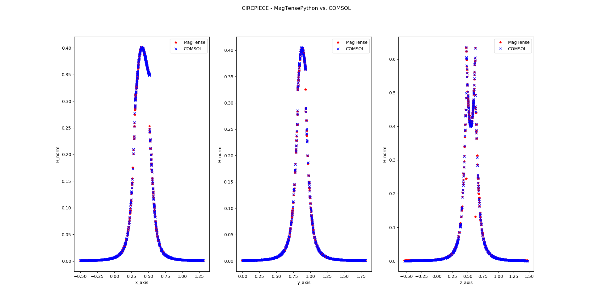

## Validation inverted circular piece

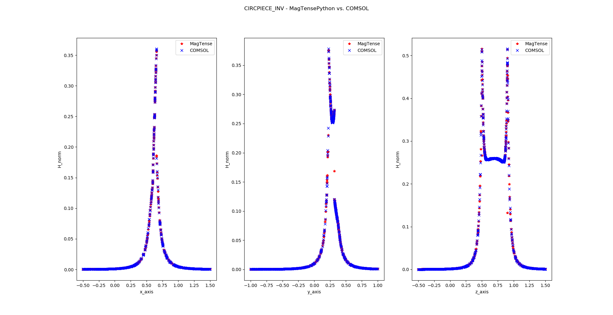

## Validation prism

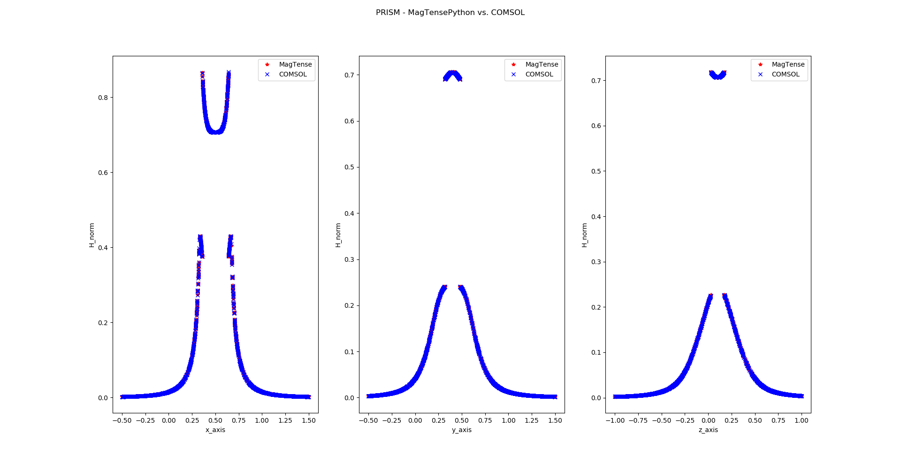

## Validation sphere

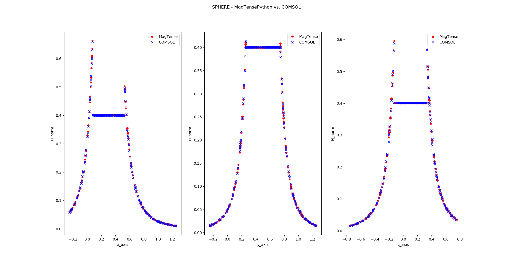

## Validation spheroid

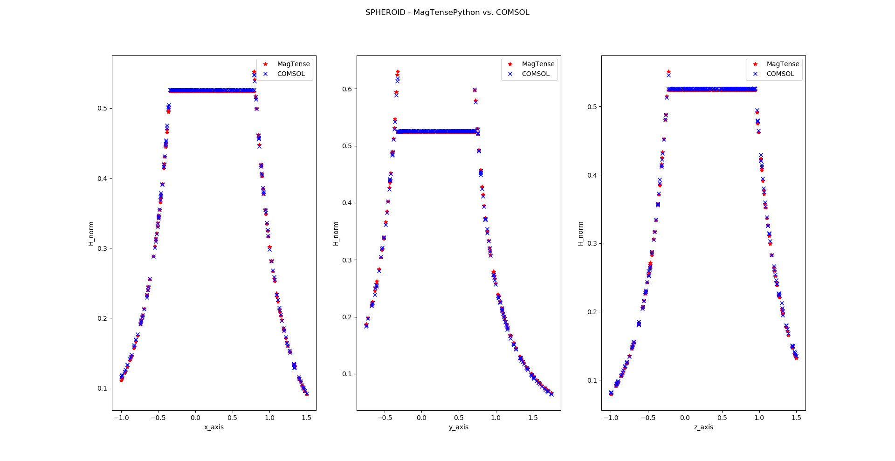

## Validation tetrahedron

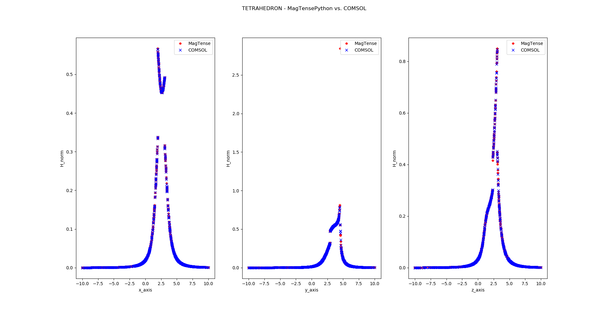
